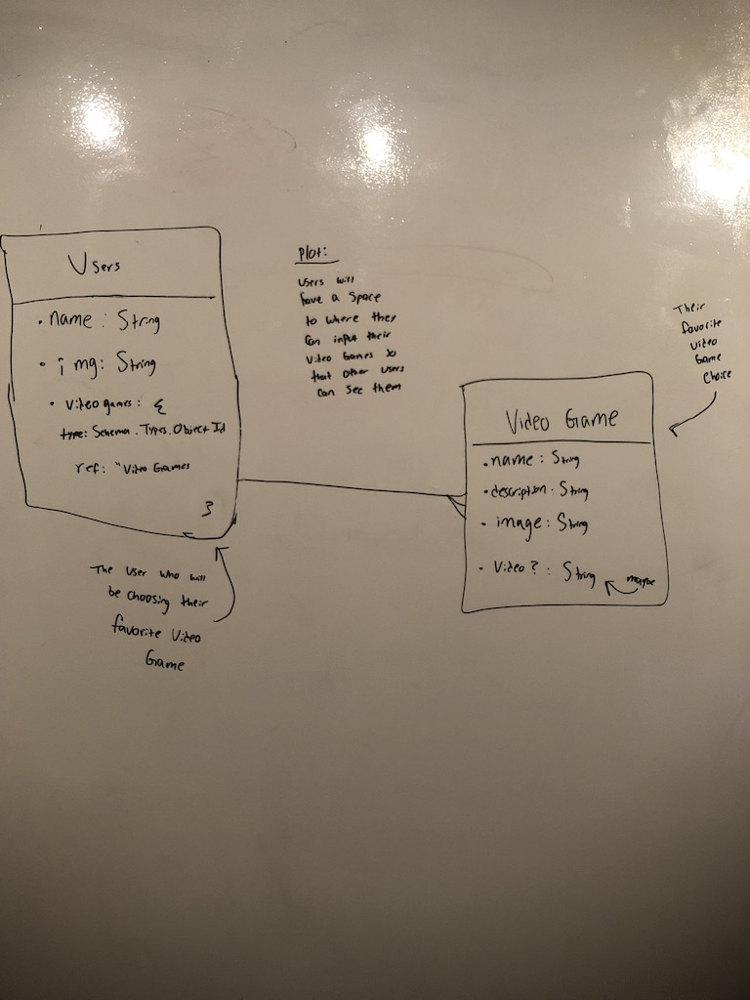
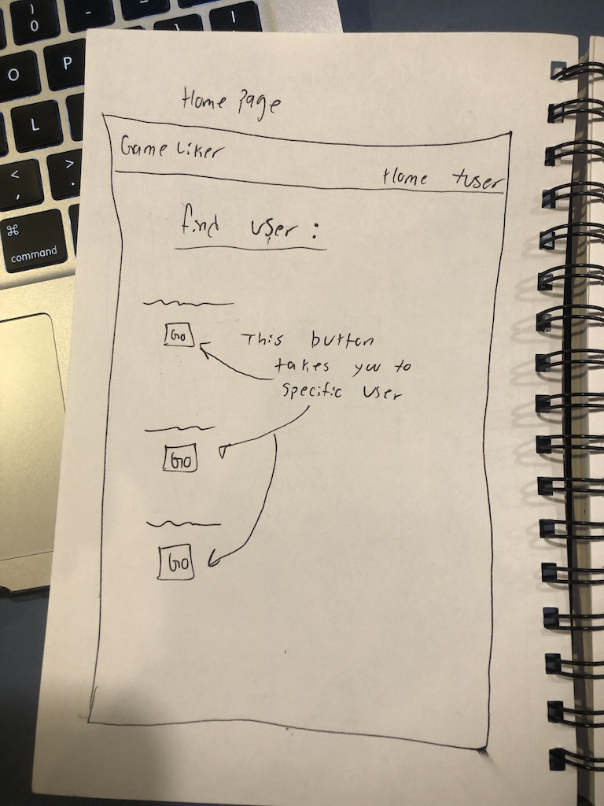
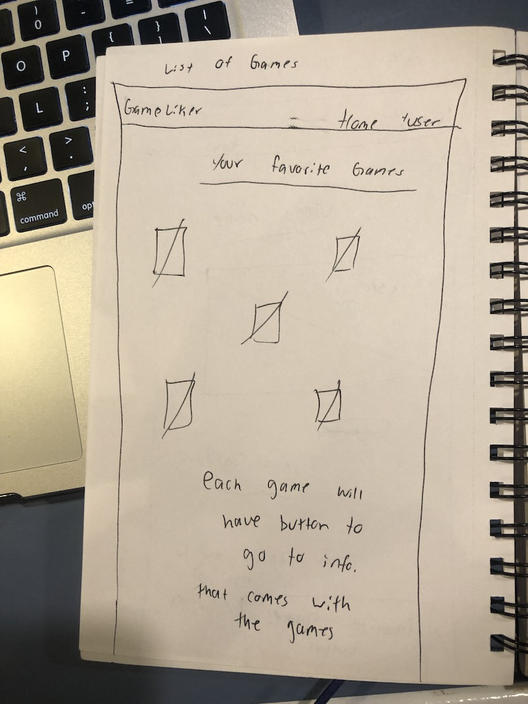
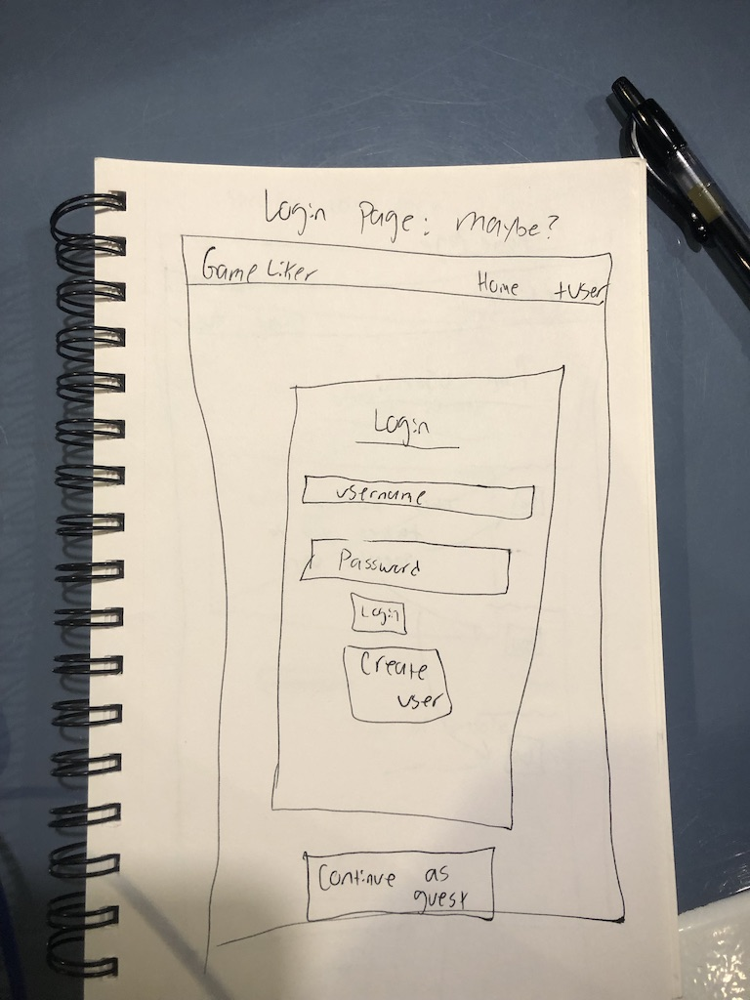
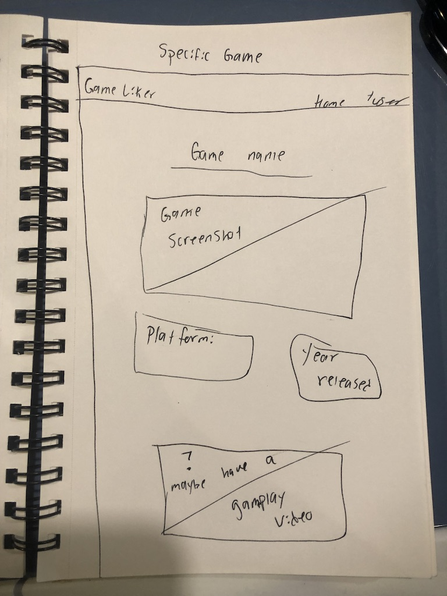
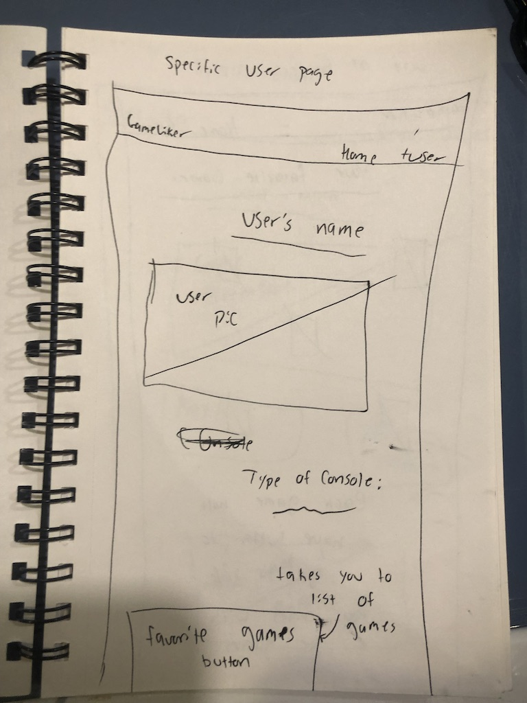

# Gen-Game

# Overview:

- For Project 3, I created a app where game lovers can go and log the games that they've played and loved, so other game lovers can see. It's an envrionment where you can show your taste in games.

## Live Site: 

# Technologies Used:
### Languages:
- MongoDb
- Express.js
- HTML 5
- CSS 3
- React.js
### Design:
- React UI - Materialize
### Project Planning and User Stories 
- [Trello](https://trello.com/b/T3Zu4mZr/project-3)
### Visual Studio Code

# WireFrame:

# ERDs:

# Future Development:
- I want to be able have an external api, for example: [IGDB](https://igdb.github.io/api/) or 
[Giant Bomb](https://www.giantbomb.com/api/).

- Would like to have a search bar with the external api integrated to where users can search up unlimited amounts of game option so that they can like and follow.

- Have more data showing up like gameplay videos and screen shots.